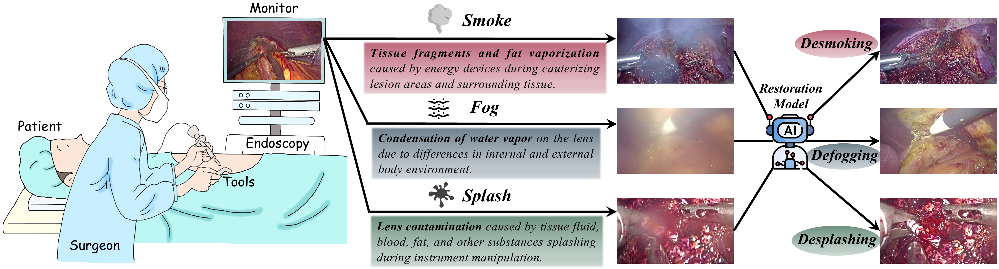
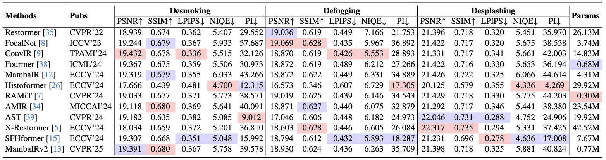
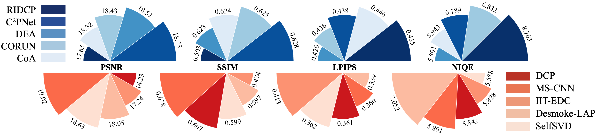
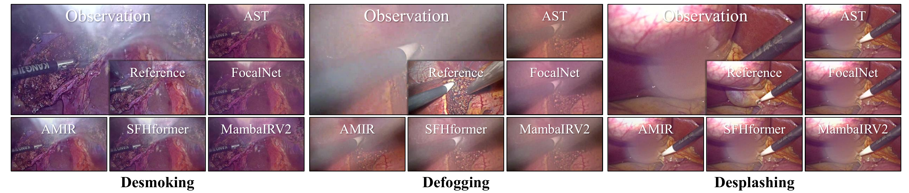

#  [CVPR][2026] Surgical Image Restoration Benchmark

 

This repo is the official implementation of "[**Benchmarking Endoscopic Surgical Image Restoration and Beyond**](https://arxiv.org/abs/2505.19161)" (___CVPR 2026___).

[Jialun Pei](https://scholar.google.com/citations?user=1lPivLsAAAAJ&hl=en), [Diandian Guo](https://scholar.google.com/citations?user=yXycwhIAAAAJ&hl=zh-CN&oi=ao), [Donghui Yang](), [Zhixi Li](), [Yuxin Feng](), [Long Ma](https://scholar.google.com/citations?user=QeCRo9sAAAAJ&hl=zh-CN&oi=ao), [Bo Du](https://scholar.google.com/citations?user=Shy1gnMAAAAJ&hl=zh-CN&oi=ao), and [Pheng-Ann Heng](https://scholar.google.com/citations?user=OFdytjoAAAAJ&hl=zh-CN)

<div align="center" style="display: flex; justify-content: center; flex-wrap: wrap;">
  <a href='(https://arxiv.org/abs/2505.19161'></a>&ensp; 
  <a href='(https://arxiv.org/abs/2505.19161'></a>&ensp; 
  <a href=''></a>&ensp; 
  <a href=''></a>&ensp; 
  <a href='LICENSE'></a>&ensp; 
  <!--
  <a href=''></a>&ensp; 
  <a href=''></a>&ensp; 
  -->
  </div>

**Contact:** peijialun@gmail.com, malone94319@gmail.com

### 🔧 Requirements

- Python >= 3.7 (Recommend to use [Anaconda](https://www.anaconda.com/download/#linux) or [Miniconda](https://docs.conda.io/en/latest/miniconda.html))
- [PyTorch >= 1.7](https://pytorch.org/)
- NVIDIA GPU + [CUDA 11.6](https://developer.nvidia.com/cuda-downloads)
- Linux (We have not tested on Windows)

### Installation

1. Clone the repo

    ```bash
    git clone https://github.com/PJLallen/Surgical-Image-Restoration.git
    ```

1. Install dependent packages

    ```bash
    cd Surgical-Image-Restoration
    pip install -r requirements.txt
    python setup.py develop
    ```

## 💥 SurgClean Dataset 


    
### Data Download

|     | Kaggle | Description|
| :--- | :--: | ---- |
| SurgClean | [link]() | SurgClean involves multi-type image restoration tasks, i.e., desmoking, defogging, and desplashing. It comprises 3,113 multi-type endoscopic images from two medical sites with varying degradation types and corresponding adjacent clean frames as unaligned paired labels.|

### SurgClean structure

```
├── SurgClean Dataset
	├── Defog
		├── train
			├── gt
			├── input
		├── test
			├── gt
			├── input
	├── Desmoke
	```
	├── Desplash
	```
├── SurgClean Dataset_Fine-grain Division
	├── Defog_Level
		├── test
			├── gt
				├── Level-1
				├── Level-2
				├── Level-3
				├── Level-4
			├── input
				├── Level-1
				├── Level-2
				├── Level-3
				├── Level-4
	├── Desmoke_Level
	```
	├── Desplash_Category
			├── gt
				├── bile
				├── blood
				├── fat
				├── tissue fluid
			├── input
				├── bile
				├── blood
				├── fat
				├── tissue fluid
```


## 🚀 Pretrained Models

| Desmoking      | Link | Defogging      | Link | Desplashing    | Link |
|----------------|------|----------------|------|----------------|------|
| Restormer      | [link](https://mycuhk-my.sharepoint.com/:u:/g/personal/1155229775_link_cuhk_edu_hk/IQDf-Zhd7YJUTKhlIAarYU5TAcMQYNwoGStEwKrPy7oX2Ls?e=EZ5l8t) | Restormer      | [link](https://mycuhk-my.sharepoint.com/:u:/g/personal/1155229775_link_cuhk_edu_hk/IQARCPw3X2AIQ5xdg6XDEffQAbusw9dPxuDA16tCbdw8P0o?e=DqV5v9) | Restormer      | [link](https://mycuhk-my.sharepoint.com/:u:/g/personal/1155229775_link_cuhk_edu_hk/IQAP01MMf_U9QLVzKIlE6NHJAahEGtq5tcxGljvIsV5YuUQ?e=QveCu1) |
| FocalNet       | [link](https://mycuhk-my.sharepoint.com/:u:/g/personal/1155229775_link_cuhk_edu_hk/IQDbi9w0TefBQ5JS16j60ByoAVEeFXeH4qYUYd8Km8b2Zfo?e=3qVybc) | FocalNet       | [link](https://mycuhk-my.sharepoint.com/:u:/g/personal/1155229775_link_cuhk_edu_hk/IQDJyA6iIOOGRqSmdKGJQ_BCAbRpvQnMyo0bO5px8QOEhLo?e=a2MIqy) | FocalNet       | [link](https://mycuhk-my.sharepoint.com/:u:/g/personal/1155229775_link_cuhk_edu_hk/IQDox9W4WAVaQ46DH6pa5NZkAXh8L1buJQpD7LT5A8p1mdA?e=uluCt6) |
| ConvIR         | [link](https://mycuhk-my.sharepoint.com/:u:/g/personal/1155229775_link_cuhk_edu_hk/IQBSWmmG6zVgQaYRAbi-A6-aAXhc_G_Xr8t1YQ6qhL6KMxA?e=tnZDpr) | ConvIR         | [link](https://mycuhk-my.sharepoint.com/:u:/g/personal/1155229775_link_cuhk_edu_hk/IQDXduiM4cc1SZydK60c1tuaAc_r1Z2_kdZEI_ciU5qOadI?e=AiajAg) | ConvIR         | [link](https://mycuhk-my.sharepoint.com/:u:/g/personal/1155229775_link_cuhk_edu_hk/IQCUdj5Dh0DIQZKJt3ZcAPeSAXW7MH7nxLLoDoY2jyX55rM?e=9D8JLd) |
| Fourmer        | [link](https://mycuhk-my.sharepoint.com/:u:/g/personal/1155229775_link_cuhk_edu_hk/IQCF9HYmMYBlRIKuDDrFohvZAcpTKUmacvnzrZ5pLTUzTX4?e=CWAa4y) | Fourmer        | [link](https://mycuhk-my.sharepoint.com/:u:/g/personal/1155229775_link_cuhk_edu_hk/IQCUuRpUKZaKR7nWMR7JgFFwAX17BdRZb_394ioaqXW2U2o?e=RB90Ax) | Fourmer        | [link](https://mycuhk-my.sharepoint.com/:u:/g/personal/1155229775_link_cuhk_edu_hk/IQAFvfRHGpo7RaFe5L6F4tkvAYX5ZEPrgp59wn0rjZb5FVI?e=VxeUE2) |
| MambaIR        | [link](https://mycuhk-my.sharepoint.com/:u:/g/personal/1155229775_link_cuhk_edu_hk/IQBv_wGRrQUgTrd5GgHSdMssAXmGtWOR0eyaGn6JvmAYIbE?e=admvIJ) | MambaIR        | [link](https://mycuhk-my.sharepoint.com/:u:/g/personal/1155229775_link_cuhk_edu_hk/IQBV3wONCW6uSJHTM_dKlPU8ASA-AiK2bp1-_JCWBF8WMcc?e=WC5nLG) | MambaIR        | [link](https://mycuhk-my.sharepoint.com/:u:/g/personal/1155229775_link_cuhk_edu_hk/IQA1-c_kq5SXSYKII6zy4rPGAd3ArUulKeXOeTWRd5VvioU?e=QJbpNq) |
| Histoformer    | [link](https://mycuhk-my.sharepoint.com/:u:/g/personal/1155229775_link_cuhk_edu_hk/IQBllFeJrqcpTJcvsYuLINSnAYJNl3W0MxrOW9kvZ2umdL4?e=9ipyg9) | Histoformer    | [link](https://mycuhk-my.sharepoint.com/:u:/g/personal/1155229775_link_cuhk_edu_hk/IQDp9p4VcMUzRI2RgoqipgmvAX-uaZGg-ZagyaHY6RhsbnM?e=PqB1Yp) | Histoformer    | [link](https://mycuhk-my.sharepoint.com/:u:/g/personal/1155229775_link_cuhk_edu_hk/IQAva9YevMllQr7qoWbxhpFIAeYyJ8kEMbe6Q6NpIX4c3rQ?e=oHo295) |
| RAMiT          | [link](https://mycuhk-my.sharepoint.com/:u:/g/personal/1155229775_link_cuhk_edu_hk/IQA0pWcEn69PRJQ01rBNXEz-Aes7_Xruwtghb0mtYWFwYME?e=Nvhbi5) | RAMiT          | [link](https://mycuhk-my.sharepoint.com/:u:/g/personal/1155229775_link_cuhk_edu_hk/IQAx1QDsnAi_Qa7i8-HYILNYAeJiuuAd1FwVIhceSS46wYw?e=1wQFWi) | RAMiT          | [link](https://mycuhk-my.sharepoint.com/:u:/g/personal/1155229775_link_cuhk_edu_hk/IQDDnqc4C02WT7GN9vKgjPLnAafu_nBObahjGzqxin0oZ9c?e=edpmGJ) |
| AMIR           | [link](https://mycuhk-my.sharepoint.com/:u:/g/personal/1155229775_link_cuhk_edu_hk/IQB1hQFp9O_tSpy1gmati2PcAUqcgWAkgsz_9493S6YoZqE?e=1Xg7tk) | AMIR           | [link](https://mycuhk-my.sharepoint.com/:u:/g/personal/1155229775_link_cuhk_edu_hk/IQD2Fgf5RyL_TJ_UnnjVEJ84AaYujYTDss2FaGSbrxZ1R_0?e=hcTsdl) | AMIR           | [link](https://mycuhk-my.sharepoint.com/:u:/g/personal/1155229775_link_cuhk_edu_hk/IQDZglueP6a8TplISIyC7gl-AYnyMCV2eDImLNLpXx1Qkfo?e=5dK2Ta) |
| AST            | [link](https://mycuhk-my.sharepoint.com/:u:/g/personal/1155229775_link_cuhk_edu_hk/IQCY8Eu4WX8GRY3uh_EDyRcQAdpGC4EWT65iFywmKeT6RRI?e=0fqvxS) | AST            | [link](https://mycuhk-my.sharepoint.com/:u:/g/personal/1155229775_link_cuhk_edu_hk/IQBOHvHTw14NS7-CM05W3-emAWDOXEmbFDcIz4xHVgz6vbU?e=awrD3m) | AST            | [link](https://mycuhk-my.sharepoint.com/:u:/g/personal/1155229775_link_cuhk_edu_hk/IQA8nLTZXPtwRY-kMlNjOIaBAVX_NdtKxVYklAnVveRZRk0?e=ZKuwId) |
| X-Restormer    | [link](https://mycuhk-my.sharepoint.com/:u:/g/personal/1155229775_link_cuhk_edu_hk/EdnGkPQ3jkFHt8dBQhbfAxIBVU3rjEBqkF8QXm31FJjg6w?e=S5mW9n) | X-Restormer    | [link](https://mycuhk-my.sharepoint.com/:u:/g/personal/1155229775_link_cuhk_edu_hk/EYl5A7QMOEtNqMW8dCENh1cBGYmij_YxT0A89ZoMLTwmXA?e=oJn39S) | X-Restormer    | [link](https://mycuhk-my.sharepoint.com/:u:/g/personal/1155229775_link_cuhk_edu_hk/ERDpZMQb4otLgybV53bCTr4BFLPBYPpF4vQCqOTos2FP_w?e=l6k3F4) |
| SFHformer      | [link](https://mycuhk-my.sharepoint.com/:u:/g/personal/1155229775_link_cuhk_edu_hk/IQCS5vlgM4c_RqJqlQvC7M1YASuiI8XToJ6sCRT0pD5Uvjk?e=ON5u6C) | SFHformer      | [link](https://mycuhk-my.sharepoint.com/:u:/g/personal/1155229775_link_cuhk_edu_hk/IQDLJX69X9FSQaDS2so1MVbVARd3rDXY1QrkuyXYsQSoEhk?e=MyKpPT) | SFHformer      | [link](https://mycuhk-my.sharepoint.com/:u:/g/personal/1155229775_link_cuhk_edu_hk/IQCPgTFKRT3VRaVpOPEbfVLbAcun2ruyltVCRMskgoUFvsQ?e=2TGmbD) |
| MambaIRv2      | [link](https://mycuhk-my.sharepoint.com/:u:/g/personal/1155229775_link_cuhk_edu_hk/IQCmHrFXLyo3SIj4y5y58A4kAU1B_LNV_-_Sj2fV_JTwMpc?e=8coc5a) | MambaIRv2      | [link](https://mycuhk-my.sharepoint.com/:u:/g/personal/1155229775_link_cuhk_edu_hk/IQAZuBfVa_eST6eeB6sp1lgVASy--wc9Wisvj4bs-USL73A?e=NWwH3O) | MambaIRv2      | [link](https://mycuhk-my.sharepoint.com/:u:/g/personal/1155229775_link_cuhk_edu_hk/IQAMnGKxiBoXRJemlI2TVS22ARsCCB6ZJlK4eP6xW-vSufg?e=AJoUYt) |


## Training Commands

### Single GPU Training

> PYTHONPATH="./:${PYTHONPATH}" \\\
> CUDA_VISIBLE_DEVICES=0 \\\
> python basicsr/train.py -opt options/train/SRResNet_SRGAN/train_MSRResNet_x4.yml

### Distributed Training

**8 GPUs**

> PYTHONPATH="./:${PYTHONPATH}" \\\
> CUDA_VISIBLE_DEVICES=0,1,2,3,4,5,6,7 \\\
> python -m torch.distributed.launch --nproc_per_node=8 --master_port=4321 basicsr/train.py -opt options/train/EDVR/train_EDVR_M_x4_SR_REDS_woTSA.yml --launcher pytorch

or

> CUDA_VISIBLE_DEVICES=0,1,2,3,4,5,6,7 \\\
> ./scripts/dist_train.sh 8 options/train/EDVR/train_EDVR_M_x4_SR_REDS_woTSA.yml

**4 GPUs**

> PYTHONPATH="./:${PYTHONPATH}" \\\
> CUDA_VISIBLE_DEVICES=0,1,2,3 \\\
> python -m torch.distributed.launch --nproc_per_node=4 --master_port=4321 basicsr/train.py -opt options/train/EDVR/train_EDVR_M_x4_SR_REDS_woTSA.yml --launcher pytorch

or

> CUDA_VISIBLE_DEVICES=0,1,2,3 \\\
> ./scripts/dist_train.sh 4 options/train/EDVR/train_EDVR_M_x4_SR_REDS_woTSA.yml


## ⚙️ Testing Commands

### Single GPU Testing

> PYTHONPATH="./:${PYTHONPATH}" \\\
> CUDA_VISIBLE_DEVICES=0 \\\
> python basicsr/test.py -opt options/test/SRResNet_SRGAN/test_MSRResNet_x4.yml

### Distributed Testing

**8 GPUs**

> PYTHONPATH="./:${PYTHONPATH}" \\\
> CUDA_VISIBLE_DEVICES=0,1,2,3,4,5,6,7 \\\
> python -m torch.distributed.launch --nproc_per_node=8 --master_port=4321 basicsr/test.py -opt options/test/EDVR/test_EDVR_M_x4_SR_REDS.yml --launcher pytorch

or

> CUDA_VISIBLE_DEVICES=0,1,2,3,4,5,6,7 \\\
> ./scripts/dist_test.sh 8 options/test/EDVR/test_EDVR_M_x4_SR_REDS.yml

**4 GPUs**

> PYTHONPATH="./:${PYTHONPATH}" \\\
> CUDA_VISIBLE_DEVICES=0,1,2,3 \\\
> python -m torch.distributed.launch --nproc_per_node=4 --master_port=4321 basicsr/test.py -opt options/test/EDVR/test_EDVR_M_x4_SR_REDS.yml  --launcher pytorch

or

> CUDA_VISIBLE_DEVICES=0,1,2,3 \\\
> ./scripts/dist_test.sh 4 options/test/EDVR/test_EDVR_M_x4_SR_REDS.yml

## 📈 Benchmarking Results
### Quantitative comparison for surgical image restoration on SurgClean test set.





### Qualitative comparison for surgical image restoration on SurgClean test set.



## 📚 Citation

If this helps you, please cite this work:

```bibtex
@article{pei2025benchmarking,
  title={Benchmarking Laparoscopic Surgical Image Restoration and Beyond},
  author={Pei, Jialun and Guo, Diandian and Yang, Donghui and Li, Zhixi and Feng, Yuxin and Ma, Long and Du, Bo and Heng, Pheng-Ann},
  journal={arXiv preprint arXiv:2505.19161},
  year={2025}
}
```


