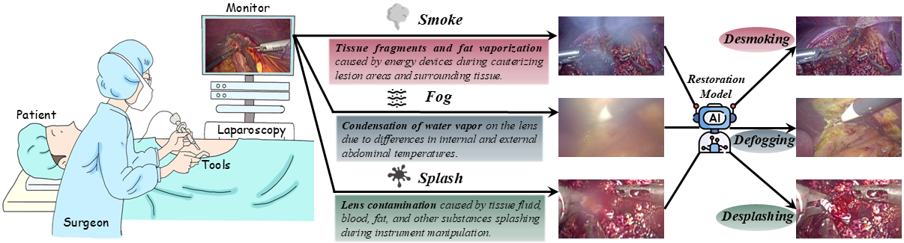
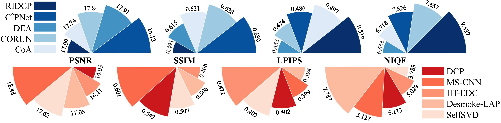

# [2025] Surgical Image Restoration Benchmark


Official Implementation of "[Benchmarking Laparoscopic Surgical Image Restoration and Beyond](https://arxiv.org/abs/2505.19161)"

[Jialun Pei](https://scholar.google.com/citations?user=1lPivLsAAAAJ&hl=en), [Diandian Guo](https://scholar.google.com/citations?user=yXycwhIAAAAJ&hl=zh-CN&oi=ao), [Donghui Yang](), [Zhixi Li](), [Yuxin Feng](), [Long Ma](https://scholar.google.com/citations?user=QeCRo9sAAAAJ&hl=zh-CN&oi=ao), [Bo Du](https://scholar.google.com/citations?user=Shy1gnMAAAAJ&hl=zh-CN&oi=ao), and [Pheng-Ann Heng](https://scholar.google.com/citations?user=OFdytjoAAAAJ&hl=zh-CN)

👀 [[Paper]](https://arxiv.org/abs/2505.19161)

**Contact:** peijialun@gmail.com, malone94319@gmail.com

### 🔧 Requirements

- Python >= 3.7 (Recommend to use [Anaconda](https://www.anaconda.com/download/#linux) or [Miniconda](https://docs.conda.io/en/latest/miniconda.html))
- [PyTorch >= 1.7](https://pytorch.org/)
- NVIDIA GPU + [CUDA 11.6](https://developer.nvidia.com/cuda-downloads)
- Linux (We have not tested on Windows)

### Installation

1. Clone the repo

    ```bash
    git clone https://github.com/PJLallen/Surgical-Image-Restoration.git
    ```

1. Install dependent packages

    ```bash
    cd Surgical-Image-Restoration
    pip install -r requirements.txt
    python setup.py develop
    ```

## 💥 SurgClean Dataset 


    
### Data Download

|     | Kaggle | Description|
| :--- | :--: | ---- |
| SurgClean | [link]() | SurgClean involves multi-type image restoration tasks, i.e., desmoking, defogging, and desplashing. It comprises 1,020 multi-type endoscopic images with varying degradation types and corresponding adjacent clean frames as unaligned paired labels.|

### SurgClean structure

```
├── SurgClean Dataset
	├── Defog
		├── train
			├── gt
			├── input
		├── test
			├── gt
			├── input
	├── Desmoke
	```
	├── Desplash
	```
├── SurgClean Dataset_Fine-grain Division
	├── Defog_Level
		├── test
			├── gt
				├── Level-1
				├── Level-2
				├── Level-3
				├── Level-4
			├── input
				├── Level-1
				├── Level-2
				├── Level-3
				├── Level-4
	├── Desmoke_Level
	```
	├── Desplash_Category
			├── gt
				├── bile
				├── blood
				├── fat
				├── tissue fluid
			├── input
				├── bile
				├── blood
				├── fat
				├── tissue fluid
```


## 🚀 Pretrained Models

| Desmoking      | Link | Defogging      | Link | Desplashing    | Link |
|----------------|------|----------------|------|----------------|------|
| Restormer      | [link](https://mycuhk-my.sharepoint.com/:u:/g/personal/1155229775_link_cuhk_edu_hk/EZElMdwlg-xNnJEdJ5KnDmoBgnpzaPacbMlUWL0mmw4BkQ?e=y4RhPO) | Restormer      | [link](https://mycuhk-my.sharepoint.com/:u:/g/personal/1155229775_link_cuhk_edu_hk/Ef4KRUl3eTZHlBT-IUNugbwBiSH9BUMeaJhdpYNkndA7NA?e=sRaH8y) | Restormer      | [link](https://mycuhk-my.sharepoint.com/:u:/g/personal/1155229775_link_cuhk_edu_hk/EZbPI4kICBpAnqF2v7CEVLkBC5nVvxsRpG7TLRU9lcYYew?e=qSdJDU) |
| FocalNet       | [link](https://mycuhk-my.sharepoint.com/:u:/g/personal/1155229775_link_cuhk_edu_hk/EYkp3P3qzTtChmDt8Acngm8BSdH7o8C_dXBXpsrBksJM_A?e=VHrUrc) | FocalNet       | [link](https://mycuhk-my.sharepoint.com/:u:/g/personal/1155229775_link_cuhk_edu_hk/EXgBrosw7lZHtmWr5tHlm9kB8wzqVYihOsWLVPH1gqyUOQ?e=LQaBaC) | FocalNet       | [link](https://mycuhk-my.sharepoint.com/:u:/g/personal/1155229775_link_cuhk_edu_hk/ESRfagqX5KBPmfmOOeULifwBUBlk1GX5d202u0bTZEe4BA?e=edsPNH) |
| ConvIR         | [link](https://mycuhk-my.sharepoint.com/:u:/g/personal/1155229775_link_cuhk_edu_hk/EdDkxFqrtm9ItTVrh_x9F3kBXJ9r9V4M64msxpI-RZSGgg?e=ypfyYI) | ConvIR         | [link](https://mycuhk-my.sharepoint.com/:u:/g/personal/1155229775_link_cuhk_edu_hk/EZKJHCVRZgpHmb1d9ic0SP8Bq2BhisPwJCZdYmRoobO7gQ?e=bJLAHy) | ConvIR         | [link](https://mycuhk-my.sharepoint.com/:u:/g/personal/1155229775_link_cuhk_edu_hk/EeKeRZkRX0FOtQG9p-L1xfABIjXw4CCITHo5cbJWUefe4A?e=sfYW2i) |
| Fourmer        | [link]() | Fourmer        | [link](https://mycuhk-my.sharepoint.com/:u:/g/personal/1155229775_link_cuhk_edu_hk/EcxpYkBdZ2lJqt6vk7aoXpcBKZzbjTQgW4uVl9ENQg8bbQ?e=sCpWmL) | Fourmer        | [link]() |
| MambaIR        | [link](https://mycuhk-my.sharepoint.com/:u:/g/personal/1155229775_link_cuhk_edu_hk/EcTnI2f19J1IjLrqecIZlh4Bc0mmlqrD_TCZdK3t15Q09Q?e=GE3hyY) | MambaIR        | [link](https://mycuhk-my.sharepoint.com/:u:/g/personal/1155229775_link_cuhk_edu_hk/EUIs5N4FOTpDutFlOSyDDiIBYe2XeYlJK3KI6CIU9X-fNQ?e=3bQ6we) | MambaIR        | [link](https://mycuhk-my.sharepoint.com/:u:/g/personal/1155229775_link_cuhk_edu_hk/EcNnTfhlFuZCqIt4QZIpUGQBlDxEHLLp0pgEikU9KmVL3w?e=rl0oU4) |
| Histoformer    | [link](https://mycuhk-my.sharepoint.com/:u:/g/personal/1155229775_link_cuhk_edu_hk/ET2UgRqyuF1MmJpykTqlAewBM4dh1hRla-HZ65q228QCbw?e=qSVhnv) | Histoformer    | [link](https://mycuhk-my.sharepoint.com/:u:/g/personal/1155229775_link_cuhk_edu_hk/EVyp0pHlWLtOqsw9RN3Vz2EBMeAP07LC0sxQi5fsjYhpJg?e=hCwc3w) | Histoformer    | [link](https://mycuhk-my.sharepoint.com/:u:/g/personal/1155229775_link_cuhk_edu_hk/ERhdTDvTpcFOv-s9LMND6nwBucC5Ft6MxFMW6jOLSfOWEQ?e=ezxlgm) |
| RAMiT          | [link](https://mycuhk-my.sharepoint.com/:u:/g/personal/1155229775_link_cuhk_edu_hk/EYlxs53PPg9IlBavLA1WFywBB2xIbFv8nDCTAA9gid8vFg?e=UmmLvo) | RAMiT          | [link](https://mycuhk-my.sharepoint.com/:u:/g/personal/1155229775_link_cuhk_edu_hk/ESwXgDOBRvlAm0iTaA2IGl0Bhuj8108A4pBWHOGlwcKBYg?e=JnK1ZU) | RAMiT          | [link](https://mycuhk-my.sharepoint.com/:u:/g/personal/1155229775_link_cuhk_edu_hk/Ee1w7Cwk5z9Bl7FsmDcPZ3oBcpqKEHDgciyaImko2q9cXQ?e=A028Qq) |
| AMIR           | [link](https://mycuhk-my.sharepoint.com/:u:/g/personal/1155229775_link_cuhk_edu_hk/EeLDHzdfjy1Gn1mjTqRUyNABUbErh0lSAOG-arypyGAuCQ?e=eGn3os) | AMIR           | [link](https://mycuhk-my.sharepoint.com/:u:/g/personal/1155229775_link_cuhk_edu_hk/ETzwN_b3prNCnGaDNB6lQlQBnSWwkGfMAxijSqQo5SEfsw?e=vav8GB) | AMIR           | [link](https://mycuhk-my.sharepoint.com/:u:/g/personal/1155229775_link_cuhk_edu_hk/EWWgHGBsYFZFgvJYb7MjA7sBITLoFBS5b2YM_jAb_zVwPg?e=AzLUI2) |
| AST            | [link](https://mycuhk-my.sharepoint.com/:u:/g/personal/1155229775_link_cuhk_edu_hk/EY-Kk6usaH5DiyPjeDFe4EUB7vZv2cNRHLHmX51iCKrEIQ?e=qnxdX9) | AST            | [link](https://mycuhk-my.sharepoint.com/:u:/g/personal/1155229775_link_cuhk_edu_hk/EeO1dAiWCdBJuY5ly1HsJz8BcyJYAkhxMd5JTBv3LSLkZg?e=CojCnU) | AST            | [link](https://mycuhk-my.sharepoint.com/:u:/g/personal/1155229775_link_cuhk_edu_hk/EY-Kk6usaH5DiyPjeDFe4EUB7vZv2cNRHLHmX51iCKrEIQ?e=qnxdX9) |
| X-Restormer    | [link](https://mycuhk-my.sharepoint.com/:u:/g/personal/1155229775_link_cuhk_edu_hk/EdnGkPQ3jkFHt8dBQhbfAxIBVU3rjEBqkF8QXm31FJjg6w?e=S5mW9n) | X-Restormer    | [link](https://mycuhk-my.sharepoint.com/:u:/g/personal/1155229775_link_cuhk_edu_hk/EYl5A7QMOEtNqMW8dCENh1cBGYmij_YxT0A89ZoMLTwmXA?e=oJn39S) | X-Restormer    | [link](https://mycuhk-my.sharepoint.com/:u:/g/personal/1155229775_link_cuhk_edu_hk/ERDpZMQb4otLgybV53bCTr4BFLPBYPpF4vQCqOTos2FP_w?e=l6k3F4) |
| SFHformer      | [link](https://mycuhk-my.sharepoint.com/:u:/g/personal/1155229775_link_cuhk_edu_hk/ERFQ6yQ4LtxInEmGli3mJq0BOkMQwZyOqyp5ln8IWCGlWw?e=ipa79T) | SFHformer      | [link](https://mycuhk-my.sharepoint.com/:u:/g/personal/1155229775_link_cuhk_edu_hk/EUpbJC0MQbBAn3nQ3ueeSRABwYHv9NGop0OA8UHeB8Tyfw?e=iackHj) | SFHformer      | [link](https://mycuhk-my.sharepoint.com/:u:/g/personal/1155229775_link_cuhk_edu_hk/ERDhDQri4zRMuOu_LDFnYZIBCBMDWOuN5pHdyxuMLtBQKg?e=QAqiLq) |
| MambaIRv2      | [link](https://mycuhk-my.sharepoint.com/:u:/g/personal/1155229775_link_cuhk_edu_hk/EWkC7mR1otRBgoop-pkaC30BxiTpblL1rc5c2YCxfIAhmA?e=guPSML) | MambaIRv2      | [link](https://mycuhk-my.sharepoint.com/:u:/g/personal/1155229775_link_cuhk_edu_hk/ES9GzKmwApNEsfO6w8oF15ABboKb-zRyTasETsYqxG73yA?e=OT1r4B) | MambaIRv2      | [link](https://mycuhk-my.sharepoint.com/:u:/g/personal/1155229775_link_cuhk_edu_hk/EcuQ4gBYwztClO76RI2bxr4BlStX-x4y6IjVBVgWHnVpRA?e=pLDzw3) |


## Training Commands

### Single GPU Training

> PYTHONPATH="./:${PYTHONPATH}" \\\
> CUDA_VISIBLE_DEVICES=0 \\\
> python basicsr/train.py -opt options/train/SRResNet_SRGAN/train_MSRResNet_x4.yml

### Distributed Training

**8 GPUs**

> PYTHONPATH="./:${PYTHONPATH}" \\\
> CUDA_VISIBLE_DEVICES=0,1,2,3,4,5,6,7 \\\
> python -m torch.distributed.launch --nproc_per_node=8 --master_port=4321 basicsr/train.py -opt options/train/EDVR/train_EDVR_M_x4_SR_REDS_woTSA.yml --launcher pytorch

or

> CUDA_VISIBLE_DEVICES=0,1,2,3,4,5,6,7 \\\
> ./scripts/dist_train.sh 8 options/train/EDVR/train_EDVR_M_x4_SR_REDS_woTSA.yml

**4 GPUs**

> PYTHONPATH="./:${PYTHONPATH}" \\\
> CUDA_VISIBLE_DEVICES=0,1,2,3 \\\
> python -m torch.distributed.launch --nproc_per_node=4 --master_port=4321 basicsr/train.py -opt options/train/EDVR/train_EDVR_M_x4_SR_REDS_woTSA.yml --launcher pytorch

or

> CUDA_VISIBLE_DEVICES=0,1,2,3 \\\
> ./scripts/dist_train.sh 4 options/train/EDVR/train_EDVR_M_x4_SR_REDS_woTSA.yml


## ⚙️ Testing Commands

### Single GPU Testing

> PYTHONPATH="./:${PYTHONPATH}" \\\
> CUDA_VISIBLE_DEVICES=0 \\\
> python basicsr/test.py -opt options/test/SRResNet_SRGAN/test_MSRResNet_x4.yml

### Distributed Testing

**8 GPUs**

> PYTHONPATH="./:${PYTHONPATH}" \\\
> CUDA_VISIBLE_DEVICES=0,1,2,3,4,5,6,7 \\\
> python -m torch.distributed.launch --nproc_per_node=8 --master_port=4321 basicsr/test.py -opt options/test/EDVR/test_EDVR_M_x4_SR_REDS.yml --launcher pytorch

or

> CUDA_VISIBLE_DEVICES=0,1,2,3,4,5,6,7 \\\
> ./scripts/dist_test.sh 8 options/test/EDVR/test_EDVR_M_x4_SR_REDS.yml

**4 GPUs**

> PYTHONPATH="./:${PYTHONPATH}" \\\
> CUDA_VISIBLE_DEVICES=0,1,2,3 \\\
> python -m torch.distributed.launch --nproc_per_node=4 --master_port=4321 basicsr/test.py -opt options/test/EDVR/test_EDVR_M_x4_SR_REDS.yml  --launcher pytorch

or

> CUDA_VISIBLE_DEVICES=0,1,2,3 \\\
> ./scripts/dist_test.sh 4 options/test/EDVR/test_EDVR_M_x4_SR_REDS.yml

## 📈 Benchmarking Results
### Quantitative comparison for surgical image restoration on SurgClean test set.




### Qualitative comparison for surgical image restoration on SurgClean test set.


## 📚 Citation

If this helps you, please cite this work:

```bibtex
@article{pei2025benchmarking,
  title={Benchmarking Laparoscopic Surgical Image Restoration and Beyond},
  author={Pei, Jialun and Guo, Diandian and Yang, Donghui and Li, Zhixi and Feng, Yuxin and Ma, Long and Du, Bo and Heng, Pheng-Ann},
  journal={arXiv preprint arXiv:2505.19161},
  year={2025}
}
```


